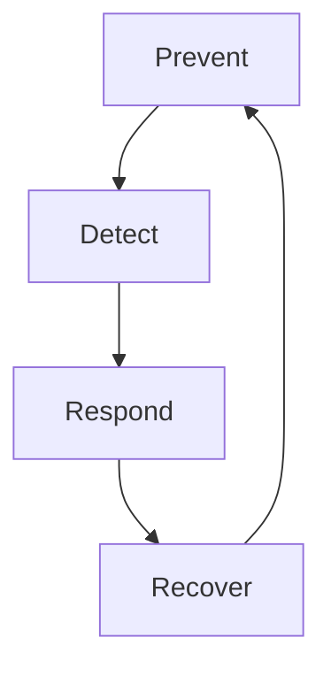

# 09. Computer Security

## 1. What is Computer Security?
**Computer Security** is the practice of protecting computer systems, data, software, and resources from unauthorized access, modification, destruction, disruption, and other security threats.

> 💡 **In simple words:**
> "Computer Security means protecting computers and the information stored or processed by them."

---

## 2. Why is Computer Security Important?
Modern organizations depend heavily on computers for various sectors:
- **Banking**
- **Healthcare**
- **Education**
- **Government**
- **Business**
- **E-commerce**
- **Cloud services**
- **Personal information**

A successful cyber attack can cause devastating results:
- **Data theft**
- **Data modification**
- **Privacy violations**
- **Financial loss**
- **Service disruption**
- **System damage**

Therefore, computer security focuses on protecting both the system and its information.

---

## 3. CIA Triad
One of the most important foundations of cybersecurity is the **CIA Triad**.

- **C** — Confidentiality
- **I** — Integrity
- **A** — Availability

### 3.1 Confidentiality
Confidentiality means preventing unauthorized people from accessing information.

* **Example:** If an attacker obtains someone's email password and reads private emails, *Confidentiality has been compromised.*
* **Common protection mechanisms:**
  - Passwords
  - Authentication
  - Authorization
  - Access control
  - Encryption

### 3.2 Integrity
Integrity means protecting data from unauthorized or incorrect modification.

* **Example:** A bank account contains `Balance = 100,000 BDT`. If an attacker changes it to `Balance = 10,000 BDT`, the *integrity of the data has been compromised.*
* **Common protection mechanisms:**
  - Hashing
  - Digital signatures
  - Access control
  - File permissions
  - Checksums

### 3.3 Availability
Availability means authorized users should be able to access systems and information when needed.

* **Example:** If an attacker causes a banking server to become unavailable, *Availability has been compromised.*
* **Common protection mechanisms:**
  - Backups
  - Redundancy
  - Disaster recovery
  - Load balancing
  - Monitoring
  - DDoS protection

---

## 4. CIA Triad Example
Consider a **university student database** containing: *Student Name, Student ID, Department, and Result.*

| Attack Type | Scenario | Outcome |
| :--- | :--- | :--- |
| **Confidentiality Attack** | An unauthorized person views the database. | ❌ Confidentiality compromised |
| **Integrity Attack** | An attacker changes a student's result. | ❌ Integrity compromised |
| **Availability Attack** | The server becomes unavailable and students cannot access results. | ❌ Availability compromised |

---

## 5. Common Computer Security Threats
* **Malware:** Malicious software designed to damage, disrupt, spy on, or gain unauthorized access to systems. *(Examples: Virus, Worm, Trojan, Ransomware, Spyware)*
* **Unauthorized Access:** Accessing a computer or resource without permission.
* **Data Theft:** Stealing sensitive information from a system.
* **Data Modification:** Changing information without authorization.
* **Denial of Service (DoS):** Making a system or service unavailable to legitimate users.
* **Social Engineering:** Manipulating people into revealing information or performing actions that help an attacker.

---

## 6. Authentication vs Authorization
These two concepts are fundamental but often confused.

### Authentication
- **Core Question:** "Who are you?"
- **Example:** A user enters a username and password. The system verifies the user's identity.
- **Keywords:** `Authentication ➔ Identity`

### Authorization
- **Core Question:** "What are you allowed to do?"
- **Example:** A normal user can view their own profile, while an administrator can modify other users' accounts.
- **Keywords:** `Authorization ➔ Permission`

---

## 7. Attack Surface
The **Attack Surface** is the collection of possible entry points or exposed components that an attacker may attempt to exploit.

```text
Internet
   │
Firewall
   │
Computer
 ├── Web Browser
 ├── Open Ports
 ├── Applications
 ├── Operating System
 └── User Accounts
```

Security professionals always try to **reduce the unnecessary attack surface** by:
- Disabling unnecessary services
- Closing unnecessary ports
- Removing unused applications
- Keeping software updated
- Restricting user permissions

---

## 8. Vulnerability, Threat, and Risk
These three concepts are closely related but distinctly different.

### Vulnerability
A weakness in a system.
- *Examples:* Weak password, outdated software, misconfigured server, unpatched vulnerability.

### Threat
A person, event, or situation that can potentially exploit a vulnerability.
- *Examples:* Attacker, malware, insider, natural disaster.

### Risk
Risk represents the possibility of loss or damage resulting from a threat exploiting a vulnerability. 

\[\text{Risk} \approx \text{Likelihood} \times \text{Impact}\]

- **Likelihood:** How likely the event is to happen.
- **Impact:** How much damage it could cause.

---

## 9. Security Is Not 100% Guaranteed
A security system cannot usually guarantee absolute security. The ultimate goal is to:
1. Prevent attacks
2. Detect attacks
3. Respond to attacks
4. Limit damage
5. Recover from incidents

### The Security Lifecycle


---

## 10. Defense in Depth
Defense in Depth means using **multiple layers of security** instead of relying on a single security mechanism.

```text
[Internet] ➔ [Firewall] ➔ [Authentication] ➔ [Access Control] ➔ [Endpoint Security] ➔ [Application Security] ➔ [Encryption] ➔ [Backup]
```
*If one layer fails, another layer may still provide protection.*

> 🛡️ **Example:** Suppose an attacker steals a user's password. If the account also requires Multi-Factor Authentication (MFA), the attacker may still be unable to log in. This is a classic example of layered security.

---

## 11. Computer Security vs Cybersecurity
* **Computer Security** is mainly concerned with protecting:
  - Computers, operating systems, software, files, devices, and local computer resources.
* **Cybersecurity** is broader and encompasses:
  - Computer Security, Network Security, Application Security, Internet Security, Cloud Security, Information Security, Identity Security, Mobile Security, and Operational Security.

> 📌 **Conclusion:** "Computer Security is an important part of the broader cybersecurity field."

---

## 12. Key Concepts & Quick Revision

### Key Map
```text
Computer Security
       │
       ├── Confidentiality (Protect access)
       ├── Integrity (Protect modification)
       ├── Availability (Ensure access)
       │
       ├── Authentication (Identity check)
       ├── Authorization (Permission check)
       ├── Vulnerability (Weakness)
       ├── Threat (Potential danger)
       ├── Risk (Possibility of loss)
       ├── Attack Surface (Entry points)
       └── Defense in Depth (Layered defense)
```

### Quick Definitions
* **Confidentiality:** Prevent unauthorized access to information.
* **Integrity:** Prevent unauthorized or incorrect modification of information.
* **Availability:** Ensure authorized users can access systems and information when needed.
* **Authentication:** Verify who a user is.
* **Authorization:** Determine what a user is allowed to do.
* **Vulnerability:** A weakness in a system.
* **Threat:** Something that can potentially exploit a vulnerability.
* **Risk:** The possibility of loss or damage.
* **Attack Surface:** Potential entry points that attackers may target.
* **Defense in Depth:** Using multiple layers of security.

---

## 13. Important Mental Model
Always analyze security issues by asking these **10 essential questions**:
1. What are we protecting?
2. Who should have access?
3. What can go wrong?
4. What vulnerabilities exist?
5. What threats exist?
6. What is the potential impact?
7. How can we prevent the attack?
8. How can we detect it?
9. How can we respond?
10. How can we recover?
11.
