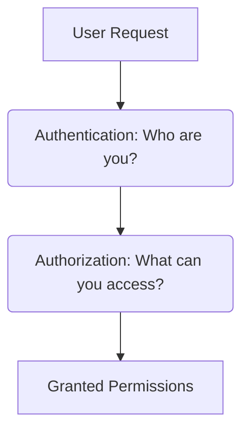

# 10. Network Security

## 1. What is Network Security?
**Network Security** is the process of protecting network-connected devices, data, and communication from unauthorized access, cyber attacks, data theft, and service disruptions.

> 💡 **In simple words:**
> "Network Security means keeping the data flowing through the network and all connected devices safe and secure."

---

## 2. Why is Network Security Needed?
A massive amount of sensitive data is constantly transferred across networks. This includes:
- Passwords and login credentials
- Personal identifiable information (PII)
- Banking and financial records
- Proprietary company data
- Emails and private messages
- Critical business files

If a network remains unsecure, an attacker can easily:
- Gain unauthorized access to the entire infrastructure.
- Steal sensitive and confidential data.
- Intercept and spy on network traffic.
- Disrupt critical services and cause downtime.

### Core Objectives:
* **Data Protection:** Securing data both in transit and at rest.
* **Access Prevention:** Stopping unauthorized entities from entering the network.
* **Traffic Filtering:** Blocking malicious data packets before they cause harm.
* **Network Availability:** Ensuring uninterrupted uptime for legitimate users.

---

## 3. How Does Network Security Work?
Network Security relies on the principle of **Defense in Depth**, utilizing multiple layers of defensive controls.

```text
User / Device ➔ Network ➔ Security Controls ➔ Protected Resource
```

### Layered Defense Example:
```text
Device
  │
  ▼
Firewall (Filters Traffic)
  │
  ▼
Authentication (Verifies Identity)
  │
  ▼
Access Control (Checks Permissions)
  │
  ▼
Network Resource (Protected Destination)
```
Each security mechanism has a distinct, specialized role to play in protecting the ecosystem.

---

## 4. Firewall
A **Firewall** acts as the network's security gatekeeper. It monitors incoming and outgoing network traffic and decides whether to **allow** or **block** specific traffic based on a defined set of security rules.

```text
[ Internet ] ───► [ Firewall ] ───► [ Server ]
                       │
             (Checks Security Rules)
```

### What does a Firewall inspect?
* **Source IP:** Where the traffic is coming from.
* **Destination IP:** Where the traffic is trying to go.
* **Port:** The specific communication channel being targeted.
* **Protocol:** The rules governing the data transport (e.g., TCP, UDP).

---

## 5. Authentication
Authentication is used in network security to verify the identity of a user or a device attempting to connect to the network.

* **Example:** Entering a password to connect to a secure Wi-Fi network.

```text
User ➔ Input Username/Password ➔ Authentication Process ➔ Access Granted
```

> 🔎 **The Core Question of Authentication:** 
> *"Who are you?"*

---

## 6. Authorization & Access Control
Once **Authentication** successfully verifies *who* the user is, **Authorization** determines *what* that user is permitted to do or access within the network.

* **Example:** An employee can log into the company network, but they are only allowed to view files belonging to their specific department.



---

## 7. Encryption
Encryption protects data as it travels across the network by converting human-readable plain text into an unreadable scrambled format (ciphertext). 

```text
Original Data ➔ Encryption ➔ Encrypted Data (In Transit) ➔ Decryption ➔ Original Data
```
* **Why it matters:** Even if an attacker intercepts and captures the network packets, they cannot read or understand the data without the corresponding decryption key.
* **Real-world Example:** **HTTPS** is a common protocol that uses encryption to secure communication between your web browser and a website.

---

## 8. VPN (Virtual Private Network)
A **VPN** creates a secure, encrypted connection (often called a tunnel) over a less secure network, such as the public internet.

```text
Your Device ───► [ Encrypted VPN Tunnel ] ───► Internet / Private Network
```

### Primary Uses of a VPN:
* **Remote Access:** Allowing employees to securely connect to the office network from home.
* **Traffic Protection:** Safeguarding data sent over insecure public Wi-Fi networks.
* **Secure Interconnection:** Connecting geographically separated private networks securely.

---

## 9. IDS and IPS
Both tools monitor network traffic but respond differently when an anomaly is detected.

### IDS (Intrusion Detection System)
Monitors network traffic for suspicious activities and issues alerts when potential threats are found.
```text
Network Traffic ➔ IDS ➔ Suspicious Activity Detected ➔ ⚠️ Alert Triggered
```

### IPS (Intrusion Prevention System)
Monitors network traffic, detects threats, and actively takes steps to **block or prevent** the malicious activity automatically.
```text
Network Traffic ➔ IPS ➔ Suspicious Activity Detected ➔ 🛑 Traffic Blocked
```

| System | Primary Action | Strategy |
| :--- | :--- | :--- |
| **IDS** | Detect + Alert | Passive |
| **IPS** | Detect + Prevent/Block | Active |

---

## 10. Common Network Security Threats
* **Malware:** Malicious software (viruses, worms) designed to spread across network devices.
* **DoS / DDoS (Denial of Service):** Flooding a network or server with overwhelming traffic to make it unavailable to legitimate users.
* **Man-in-the-Middle (MitM):** An attack where the perpetrator positions themselves between two communicating parties to secretly intercept and alter data.
* **Packet Sniffing:** Using software tools to capture and log raw data packets traveling through a network to extract sensitive details.
* **Unauthorized Access:** Breaking into a network or accessing restricted resources without proper permission.

---

## 11. Practical Architecture Example
Consider a standard corporate network architecture layout:

```text
                   [ Internet ]
                        │
                        ▼
                  [ Firewall ] (Blocks unauthorized traffic)
                        │
                        ▼
               [ Company Network ]
                        │
      ┌─────────────────┼─────────────────┐
      ▼                 ▼                 ▼
   [ PC ]          [ Server ]         [ Wi-Fi ]
(Access Control)  (IDS/IPS Alert)  (Authentication)
```
* Together, these technologies work in unison to form a unified, resilient **Network Security** perimeter.

---

## 12. Network Security and the CIA Triad
The fundamental objectives of network security align directly with the pillars of the **CIA Triad**:

* **Confidentiality:** Ensured via **Encryption** and **VPNs** so that unauthorized parties cannot read intercepted network data.
* **Integrity:** Ensured via protocols that track packet delivery to guarantee network data is not altered or tampered with during transit.
* **Availability:** Ensured via **Firewalls** and **IPS** to keep the network stable and resilient against DDoS attacks and unexpected downtime.

---

## 13. Key Concepts to Remember
* **Network Security** safeguards networks, devices, and data transit routes.
* **Firewalls** act as traffic filters based on predefined security rules.
* **Authentication** verifies *identity*, while **Authorization** manages *permissions*.
* **Encryption** renders intercepted data unreadable to thieves.
* **VPNs** establish safe, encrypted pathways across the public internet.
* **IDS** detects and warns; **IPS** detects and actively stops network threats.

---

## 14. Quick Revision Map

```text
                       Network Security
                              │
               ┌──────────────┴──────────────┐
               ▼                             ▼
       Core Objectives               Defense Toolset
       ├── Confidentiality           ├── Firewall & VPN
       ├── Integrity                 ├── Encryption
       └── Availability              ├── Authentication
                                     └── IDS / IPS
```
