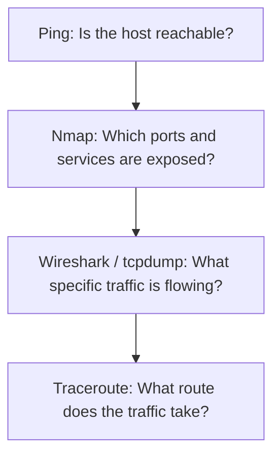

# 11. Network Security Tools

## 1. What are Network Security Tools?
**Network Security Tools** are software programs and command-line utilities used to discover, monitor, analyze, test, and troubleshoot networks.

They help security professionals understand:
- What devices are connected to the network
- Which ports are open on a system
- Which services are running on those ports
- What kind of network traffic is flowing
- Whether any suspicious or malicious activity exists
- Whether a network connection is operating correctly

---

## 2. Why are Network Security Tools Needed?
Security professionals need deep visibility to understand exactly what is happening inside a network. These tools are essential for:
- **Network discovery:** Finding active devices.
- **Port scanning:** Identifying potential entry points.
- **Traffic analysis:** Inspecting data packets.
- **Connectivity testing:** Verifying if systems can talk to each other.
- **Troubleshooting:** Diagnosing network failures.
- **Security investigation:** Analyzing cyber attacks or breaches.
- **Network monitoring:** Keeping track of network health in real-time.

---

## 3. Nmap (Network Mapper)
**Nmap** is a highly popular, open-source network scanning and discovery tool.

It helps security specialists identify:
- Active hosts (devices that are online)
- Open ports on those hosts
- Running services and their functionalities
- Service/version information and operating system details

### Example Command:
```bash
nmap 192.168.1.1
```

### Why is Nmap used?
- Network discovery and inventory mapping
- Comprehensive port scanning
- Security auditing and vulnerability assessment
- Network troubleshooting

> ⚠️ **Important Security Warning:**
> "Nmap should only be used against systems and networks that you own or have explicit, written permission to test."

---

## 4. Wireshark
**Wireshark** is a powerful graphical network protocol analyzer that lets you capture and interactively browse the traffic running on a computer network.

### Basic Mechanism:
```text
Network ➔ Packets ➔ Wireshark ➔ Traffic Analysis
```

### Why is Wireshark used?
- Advanced network troubleshooting
- Deep packet inspection and analysis
- Learning network protocols hands-on
- Cybersecurity incident investigation
- Analyzing bandwidth and traffic patterns

---

## 5. tcpdump
**tcpdump** is a lightweight, command-line network packet capture and analysis tool. It allows users to intercept and display TCP/IP and other packets being transmitted or received over a network.

### Example Command:
```bash
tcpdump
```
*It is especially useful on remote Linux servers or headless systems where a graphical interface (GUI) is not available.*

### Quick Interface Comparison:
* 🖥️ **Wireshark** ➔ Graphical User Interface (GUI)
* 💻 **tcpdump** ➔ Command-Line Interface (CLI)
> *Both tools serve the fundamental purpose of capturing and analyzing network traffic.*

---

## 6. Ping
**Ping** is a foundational network utility used to test the reachability of a host on an Internet Protocol (IP) network.

### Example Command:
```bash
ping 8.8.8.8
```
It measures the round-trip time for messages sent from the originating host to a destination computer. It heavily relies on the **ICMP (Internet Control Message Protocol)**.

### Basic Mechanism:
```text
Your Device ───► (ICMP Request) ───► Destination
    ▲                                    │
    └─────────── (ICMP Response) ◄───────┘
```
*If a response is successfully received, it indicates basic network connectivity is functional.*

---

## 7. Traceroute / Tracert
**Traceroute** is a diagnostic tool used to display the exact path (route) and measure transit delays of packets across an Internet Protocol (IP) network.

### Linux / macOS Command:
```bash
traceroute example.com
```

### Windows Command:
```cmd
tracert example.com
```

### Basic Mechanism:
```text
Your Computer ➔ Router ➔ ISP ➔ Other Routers ➔ Destination
```

### Why is it used?
- Network path visualization and troubleshooting
- Pinpointing network latency issues
- Identifying the exact hop where a connection drops or fails

---

## 8. Netcat (nc)
**Netcat** is a versatile networking utility used for reading from and writing to network connections using TCP or UDP protocols. It is often referred to as the *"Swiss Army knife"* of networking.

### Common Uses:
- Port scanning and connection testing
- Remote port listening and troubleshooting
- Basic client/server communication setup
- File transfers over networks
- Cybersecurity labs and penetration testing setups

---

## 9. Tool Comparison Table

| Tool | Main Purpose | Interface Type | Primary Protocol/Focus |
| :--- | :--- | :--- | :--- |
| **Nmap** | Network and port discovery | CLI / GUI (Zenmap) | Host Scanning & Footprinting |
| **Wireshark** | Packet and traffic analysis | Graphical (GUI) | Deep Packet Inspection |
| **tcpdump** | Command-line packet capture | Command Line (CLI) | Server-side Traffic Capture |
| **Ping** | Connectivity testing | Command Line (CLI) | ICMP Reachability |
| **Traceroute** | Network path analysis | Command Line (CLI) | Hop-by-Hop Path Mapping |
| **Netcat** | Connection and port testing | Command Line (CLI) | Raw TCP/UDP Communication |

---

## 10. How These Tools Work Together
Different tools are used at different stages of a network investigation or security audit. You can follow this logical workflow:


*Each tool provides a different layer of context, giving you a complete view of the network.*

---

## 11. Important Things to Remember
* **Nmap** is for network mapping and port discovery.
* **Wireshark** is for visual packet analysis and traffic deep-dives.
* **tcpdump** is the go-to tool for command-line packet capturing.
* **Ping** handles quick up/down connectivity checks.
* **Traceroute** helps you map the routing hops across a network.
* **Netcat** handles flexible raw network connections.

> 🛡️ **Ethics Reminder:** Network scanning, mapping, and sniffing should **never** be performed on public or third-party networks without proper authorization.

---

## 12. Quick Revision Map

```text
                           Network Tools
                                 │
         ┌───────────────────────┼───────────────────────┐
         ▼                       ▼                       ▼
    Connectivity             Discovery               Analysis
    ├── Ping                └── Nmap                ├── Wireshark
    ├── Traceroute                                  ├── tcpdump
    └── Netcat                                      └── Netcat
```
